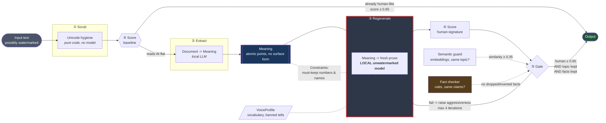
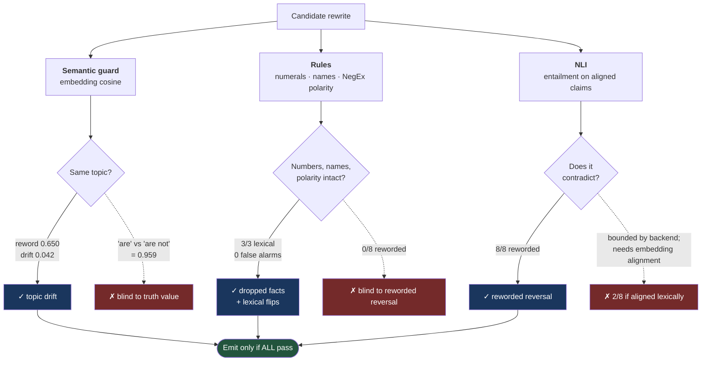
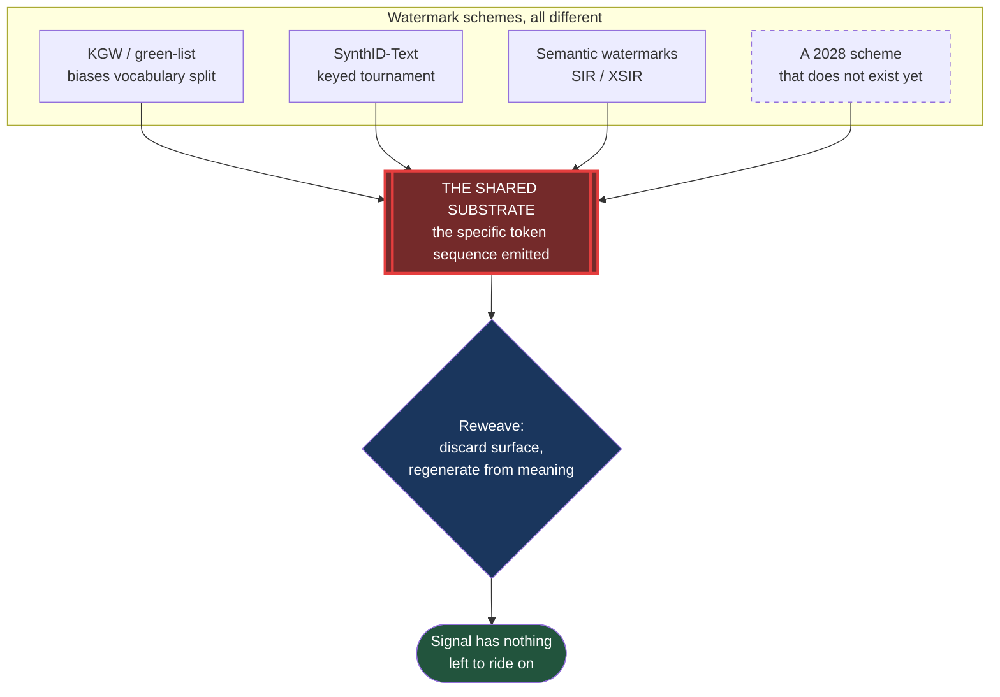
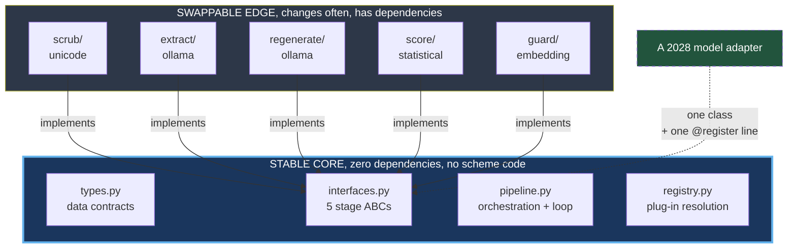
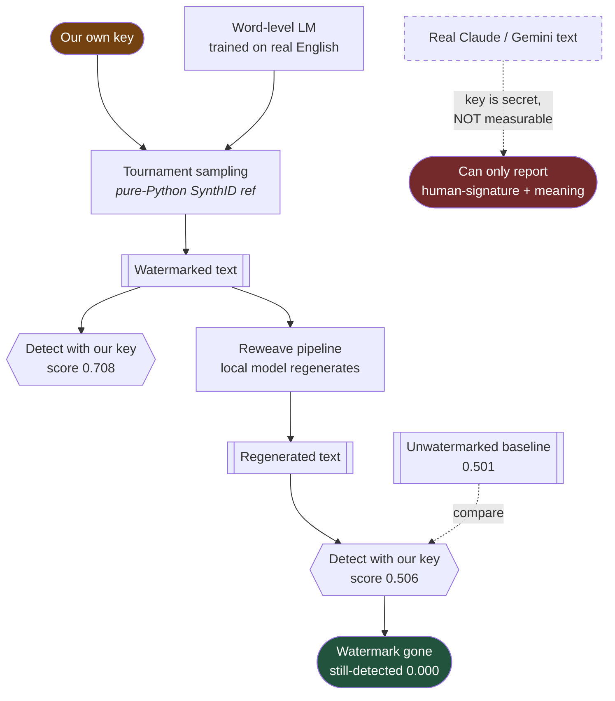
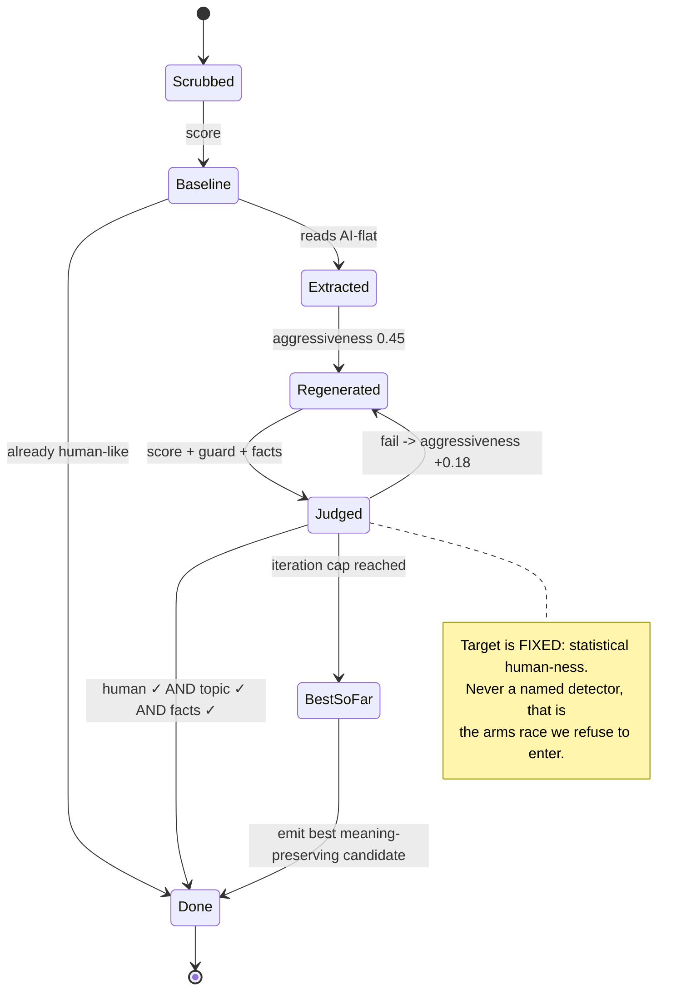
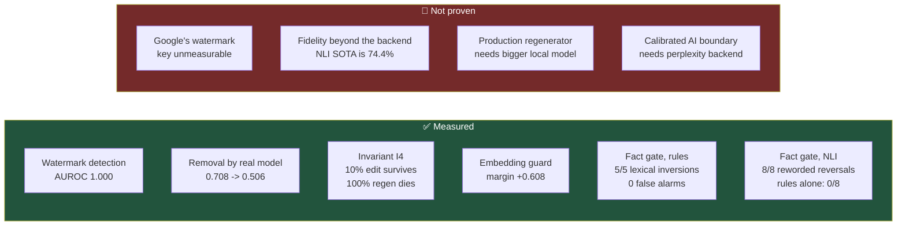

# Architecture diagrams

Mermaid renders natively on GitHub. Companion to [ARCHITECTURE.md](../ARCHITECTURE.md);
numbers referenced here are measured in [RESULTS.md](../RESULTS.md).

---

## 1. The pipeline: how a document flows

The red border on Stage ③ marks the **Self-Watermark Trap**: regenerating with a
watermarked model strips the old mark and stamps a fresh one, so that stage must
run a local open-weight model. `Pipeline.__init__` refuses a regenerator not
declared `is_unwatermarked`.

---

## 1b. Why the gate needs two tests

Each instrument's blind spot is another's competence, and the red boxes are the
honest residue. Embedding blindness to negation is a documented property of
distributional representations, not a tuning failure, no similarity floor fixes
it. The rules are lexical: NegEx negation plus a curated antonym list, so a
reversal in different words is invisible to them. NLI sees that, but only because
**embeddings do its alignment**, align lexically and it collapses to 2/8, since
the reworded pairs never reach the model.

Order matters: rules run first and NLI can only *add* findings, so a model that
is unavailable or wrong can never weaken the deterministic guarantee.

---

## 2. Why it survives future models: the substrate attack

They differ in *how* they bias the sequence; they are identical in *depending* on
it. We never model a scheme, we remove the ground it stands on. That is why a
scheme nobody has published yet is already handled.

---

## 3. Stable core / swappable edge: dependencies point inward

The core imports nothing from the edge and nothing third-party, so it cannot rot.
Adopting a new model is one adapter plus one registry line, **if it requires a
core edit, an invariant was violated.**

---

## 4. How the harness proves it: ground truth requires holding the key

You cannot verify removal of a *keyed* watermark without the key, so the harness
watermarks with its own. The right branch is the permanent honesty boundary: for
third-party text we report only what we can actually measure.

---

## 5. The convergence loop: optimising to a fixed target

Because the target is human-ness rather than any particular detector, a new
detector shipping tomorrow requires no change here.

---

## 6. Where the numbers land

